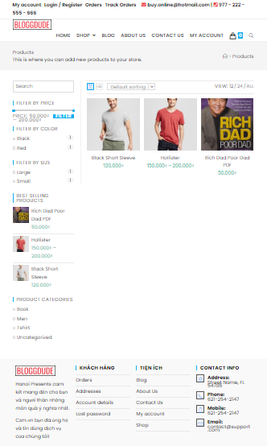
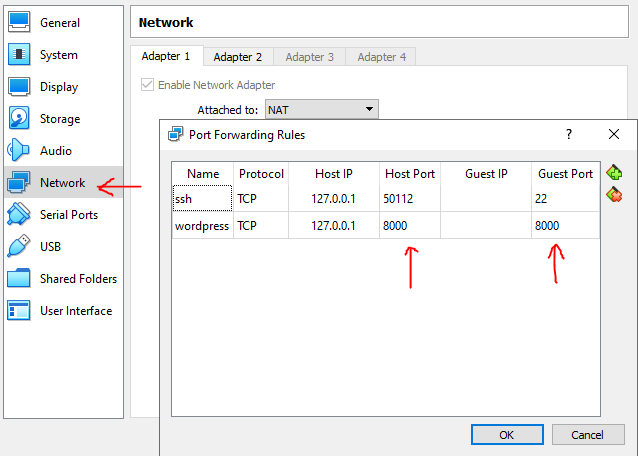
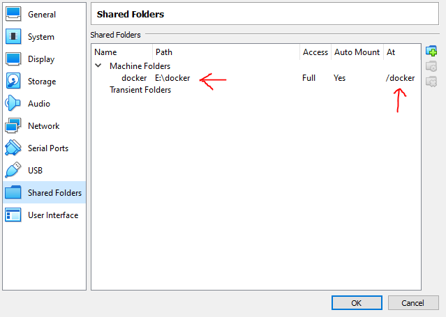

# BuyOnline v1.1
BuyOnline v1.1 is a web-based shopping system which allows peoples to buy goods from anywhere with their internet connected devices. Besides, the system manager can also offer new products as well as process orders created by customers.
In particular, the system has been developed by leveraging techniques as below:
- [WordPress]
- [WooCommerce]
- [Elementor]

## Screenshots
 

## Development Guideline
There are two ways to deploy this application locally:
- Docker
- Web service stack (ie. AMPPS, XAMPP)

However, Docker seems to be the most effortless approach to make the whole system up and running quickly. Therefore, the guideline will present all necessary steps to launch the application using Docker.

### Requirements
- Docker ToolBox
- VirtualBox 6.0 or later
- Docker Compose

### Theme
- Oceanwp

### Plugins
- Ocean extra
- Ocean product sharing
- Ocean social sharing
- Oceanwp sticky header
- Premium addons for elementor
- Livemesh addons for elementor
- Elements kit elementor addons
- Variation swatches for woocommerce

### Deployment Script
Create docker compose file named wp-stack.yaml in your working directory and copy the following text into it.
```yaml
version: '3.7'

services:

  wordpress:
    depends_on:
      - db
    image: wordpress
    restart: always
    links:
      - db
    ports:
      - 8000:80
    environment:
      WORDPRESS_DB_HOST: db
      WORDPRESS_DB_USER: exampleuser
      WORDPRESS_DB_PASSWORD: examplepass
      WORDPRESS_DB_NAME: exampledb
    volumes:
      - type: bind
        source: /docker/wp
        target: /var/www/html

  db:
    image: mysql:5.7
    restart: always
    environment:
      MYSQL_DATABASE: exampledb
      MYSQL_USER: exampleuser
      MYSQL_PASSWORD: examplepass
      MYSQL_RANDOM_ROOT_PASSWORD: '1'
    volumes:
      - db:/var/lib/mysql

volumes:
  wordpress:
  db:
```
### VM Configuration
Forward the guest port to the host port.


Mount the guest folder to the host folder for database backup and dynamic modification.


### Launch & Troubleshoot
Come to your working directory where the wp-stack.yaml is, run the following command to provision the system.
```bash
docker-compose -f wp-stack.yaml up -d
```

If large files can not be uploaded or the page builder works properly, it might be good to set some limitation for the system by placing those lines at the beginning of .htaccess file.
```sh
php_value upload_max_filesize 12M
php_value post_max_size 13M
php_value max_input_vars 1000
php_value memory_limit 256M
```

### Backup & Restore Database
Command to backup data.
```bash
docker run --rm --volumes-from wordpress_db_1 -v /docker/db-backup:/backup ubuntu bash -c "cd /var/lib/mysql && tar cvf backup.tar . && mv backup.tar /backup"
```

Command to restore data.
```bash
docker run --rm --volumes-from wordpress_db_1 -v /docker/db-backup:/backup ubuntu bash -c "tar xvf /backup/backup.tar -C /var/lib/mysql"
```

## References
- https://codingboost.com/how-to-set-up-wordpress-with-docker-toolbox
- https://www.youtube.com/watch?v=1EYVO6NskAc

[WordPress]:<https://wordpress.org>
[WooCommerce]:<https://woocommerce.com>
[Elementor]:<https://elementor.com>
